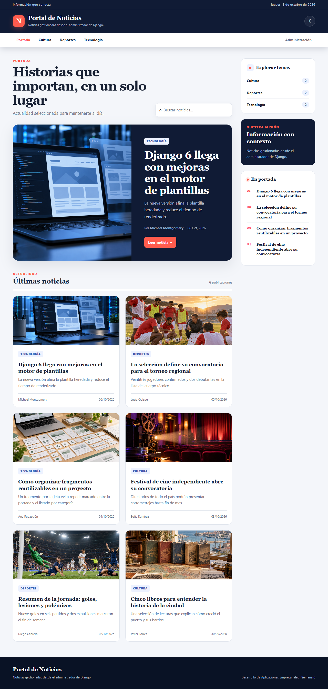
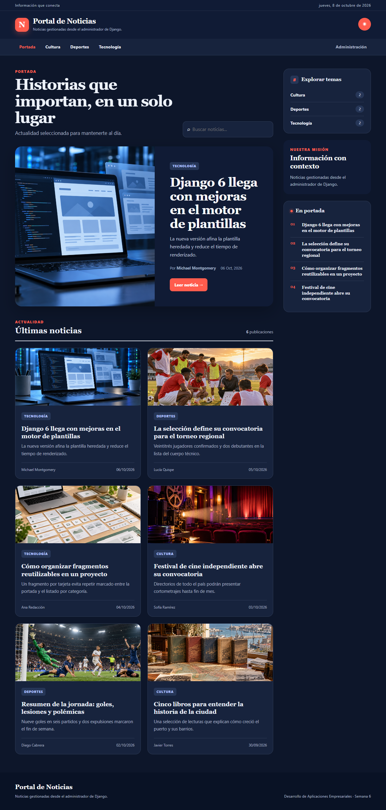
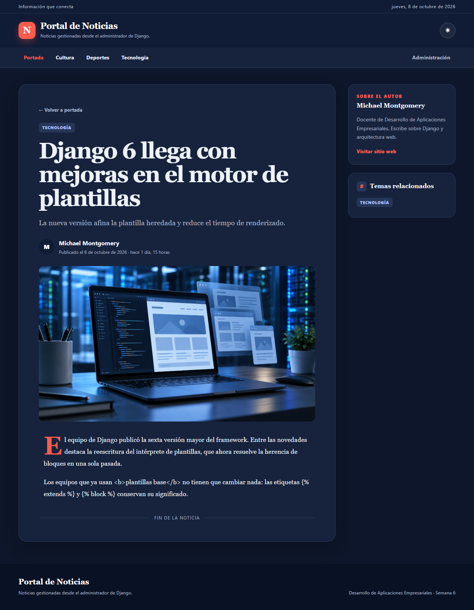
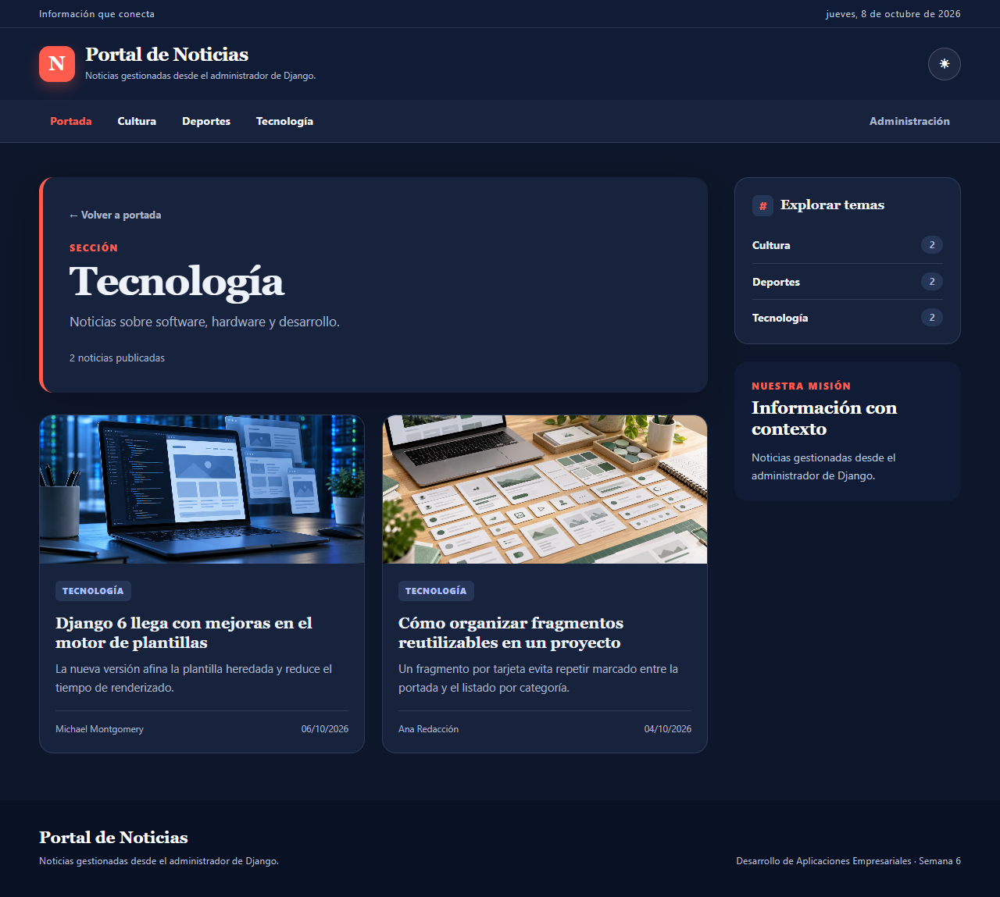
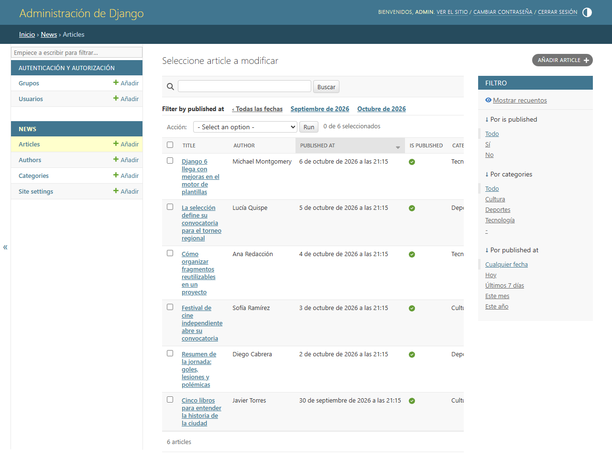
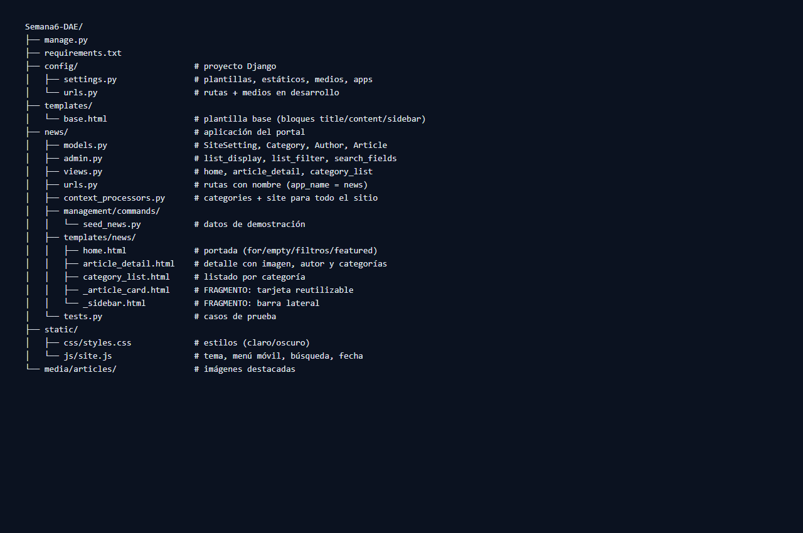

# Semana 6 · Motor de plantillas con Django

**Curso:** Desarrollo de Aplicaciones Empresariales · **Sección:** 4-C24-A
**Laboratorio:** GLAB-S06 · **Tema:** Motor de plantillas con Django

Portal de noticias construido con Django que implementa el motor de plantillas
mediante herencia y fragmentos reutilizables, muestra datos del modelo con
variables, etiquetas de control y filtros, y publica en el sitio todo lo que se
gestiona desde el administrador, sin tocar código.

---

## 1. Funcionalidades del portal

| Funcionalidad | Cómo se implementa |
| --- | --- |
| Plantilla base compartida | `templates/base.html` con bloques `title`, `content` y `sidebar`. |
| Tarjeta de noticia reutilizable | Fragmento `news/_article_card.html` incluido con `` desde la portada y el listado por categoría. |
| Barra lateral reutilizable | Fragmento `news/_sidebar.html` compartido por varias páginas. |
| Noticia destacada | La primera publicación se muestra como historia destacada (`articles.0` con ``). |
| Navegación por categorías | El header enlaza las categorías creadas en el administrador (context processor `site_menu`). |
| Búsqueda instantánea | `static/js/site.js` filtra en vivo las tarjetas por `data-search` y actualiza el contador. |
| Tema claro/oscuro | Botón en el header que persiste la preferencia en `localStorage` y usa `data-theme`. |
| Menú móvil y accesibilidad | Menú plegable, `prefers-reduced-motion`, `skip-link`, `aria-label` y `<time>` en español. |
| Fecha dinámica | `Intl.DateTimeFormat("es-PE")` en la franja superior. |
| Enlaces con `` | Ninguna dirección se escribe a mano; todo se resuelve por nombre. |

## 2. Estructura del proyecto

```
Semana6-DAE/
├── manage.py
├── requirements.txt
├── config/                        # Proyecto Django
│   ├── settings.py                # Plantillas, estáticos, medios, apps
│   └── urls.py                    # Rutas + medios en desarrollo
├── templates/
│   └── base.html                  # Plantilla base (bloques: title, content, sidebar)
├── news/                          # Aplicación del portal
│   ├── models.py                  # SiteSetting, Category, Author, Article
│   ├── admin.py                   # list_display, list_filter, search_fields
│   ├── views.py                   # home, article_detail, category_list
│   ├── urls.py                    # Rutas con nombre (app_name = "news")
│   ├── context_processors.py      # categories + site para todo el sitio
│   ├── management/commands/
│   │   └── seed_news.py           # Superusuario, 3 categorías, 6 noticias
│   ├── templates/news/
│   │   ├── home.html              # Portada: for / empty / filtros + destacada
│   │   ├── article_detail.html    # Detalle: imagen, autor y categorías
│   │   ├── category_list.html     # Listado por categoría
│   │   ├── _article_card.html     # FRAGMENTO: tarjeta reutilizable
│   │   └── _sidebar.html          # FRAGMENTO: barra lateral
│   └── tests.py                   # 10 casos de prueba
├── static/
│   ├── css/styles.css             # Estilos (tema claro y oscuro, responsive)
│   └── js/site.js                 # Tema, menú móvil, búsqueda y fecha
├── capturas/                      # Evidencias (capturas de pantalla)
└── media/articles/                # Imágenes destacadas
```

## 3. Cómo ejecutar

```bash
pip install -r requirements.txt
python manage.py migrate
python manage.py seed_news      # Crea admin, 3 categorías y 6 noticias
python manage.py runserver
```

- Portal: <http://127.0.0.1:8000/>
- Administrador: <http://127.0.0.1:8000/admin/> (usuario `admin`, clave `admin123`)

## 4. Capacidades implementadas

### 4.1 Motor de plantillas con herencia y fragmentos reutilizables

- `base.html` define la estructura común (franja superior, cabecera, nav,
  `content`, `sidebar` y pie) y los bloques que cada página completa.
- El fragmento `_article_card.html` se incluye **sin repetir marcado** desde la
  portada (`home.html`) y desde el listado por categoría
  (`category_list.html`); el fragmento `_sidebar.html` se comparte de la misma
  manera.

```django
{# home.html / category_list.html #}

    

    <div class="empty-state">...</div>

```

### 4.2 Datos del modelo con variables, etiquetas de control y filtros

- **Variables:** `{{ article.title }}`, `{{ article.author.full_name }}`,
  `{{ site.site_name }}`.
- **Control:** ``, ``, ``, `/`,
  ``, ``, ``.
- **Filtros:** `date` (localizado `es-pe`), `timesince`, `truncatewords`, `length`,
  `pluralize`, `slice`, `linebreaks`, `default`, `first`, `upper`.

```django
{# detalle de noticia #}
<p>
  Publicado el {{ article.published_at|date:"j \d\e F \d\e Y" }}
  · hace {{ article.published_at|timesince }}
</p>
<div class="article-body">{{ article.body|linebreaks }}</div>
```

### 4.3 Contenido gestionado desde el administrador y publicado en las plantillas

- Modelos `Article`, `Category`, `Author` y `SiteSetting` registrados con
  `list_display`, `list_filter`, `search_fields`, `prepopulated_fields` y
  `filter_horizontal`.
- `SiteSetting` (modelo singleton con `pk` fija) guarda `site_name` y `tagline`;
  la cabecera, la barra lateral y el pie los muestran en todas las páginas. El
  campo `announcement` queda administrable para una futura franja informativa.
- Cualquier cambio del panel se publica sin tocar código gracias al context
  processor `site_menu`, que inyecta `categories` y `site` a todas las
  plantillas.
- El seed crea **seis autores** (los integrantes del equipo) para probar que
  cada uno puede publicar sus noticias desde el administrador.

## 5. Capturas de pantalla

**Portada (tema claro)**



**Portada (tema oscuro)**



**Detalle de una noticia**



**Listado por categoría**



**Administrador: changelist de articulos**



**Estructura del proyecto en el editor**



## 6. Evidencias del desarrollo por integrante

Para cada integrante se registra: **nombre del alumno, título del desarrollo,
captura del resultado, código, explicación del resultado y casos de prueba**,
más la captura de la estructura del proyecto (sección 5).

### 6.1 Yajaira Cerron — Motor de plantillas con herencia y fragmentos

**Título del desarrollo:** Diseño e implementación del motor de plantillas del
portal con `base.html` y los fragmentos `_article_card.html` y `_sidebar.html`.

**Código**

```django
{# templates/base.html (resumen) #}
<title>{{ site.site_name }}</title>
<div class="container layout">
    <main class="content"></main>
    <aside class="sidebar"></aside>
</div>
```

```django
{# news/templates/news/_article_card.html (resumen) #}
<article class="card article-card" data-search="...">
    
        
    
    <h3 class="card-title"><a href="{{ article.get_absolute_url }}">{{ article.title }}</a></h3>
    <p class="card-summary">{{ article.summary|truncatewords:20 }}</p>
</article>
```

**Explicación del resultado:** una sola plantilla base define la estructura y
los bloques; las tres páginas (`home`, `article_detail`, `category_list`)
solo extienden la base y completan los bloques. La tarjeta de noticia es un
fragmento que se reutiliza en dos páginas, lo que evita duplicar marcado.

**Casos de prueba:** `tests.py` → `TemplateEngineTests`:
`test_home_extends_the_base_template`, `test_empty_block_when_there_are_no_articles`,
`test_card_fragment_is_reused_on_the_category_page`.

## 7. Casos de prueba

`python manage.py test news` ejecuta **10 pruebas** (todas en verde):

| # | Prueba | Capacidad que cubre |
| --- | --- | --- |
| 1 | La portada extiende `base.html` y usa el fragmento de tarjeta | 1 |
| 2 | Sin noticias se muestra el bloque `empty` | 2 |
| 3 | Las tarjetas muestran variables y filtros (resumen, fecha) | 2 |
| 4 | El listado por categoría reutiliza el fragmento de tarjeta | 1 |
| 5 | El detalle muestra autor y categorías | 2 |
| 6 | El HTML del cuerpo aparece escapado (autoescape) | 2 |
| 7 | Los enlaces entre páginas usan `` | 1 |
| 8 | El changelist del admin lista las noticias con opciones propias | 3 |
| 9 | Lo cambiado en el admin (SiteSetting) llega al sitio | 3 |
| 10 | Las noticias sin publicar se ocultan del portal | 3 |

## 8. Escapado automático (paso 12 del procedimiento)

- La noticia **"Django 6 llega con mejoras en el motor de plantillas"** guarda en
  su cuerpo la etiqueta `<b>plantillas base</b>` y las etiquetas ``
  y `` como texto.
- En el detalle se muestra como texto literal (`&lt;b&gt;plantillas base&lt;/b&gt;`),
  no como HTML aplicado.
- **¿Por qué?** Django escapa automáticamente todo valor de variable (`&`, `<`,
  `>`, `"` y `'`) antes de mostrarlo. Es una protección contra XSS; solo se
  desactiva explícitamente con `|safe`, que este laboratorio no usa.

